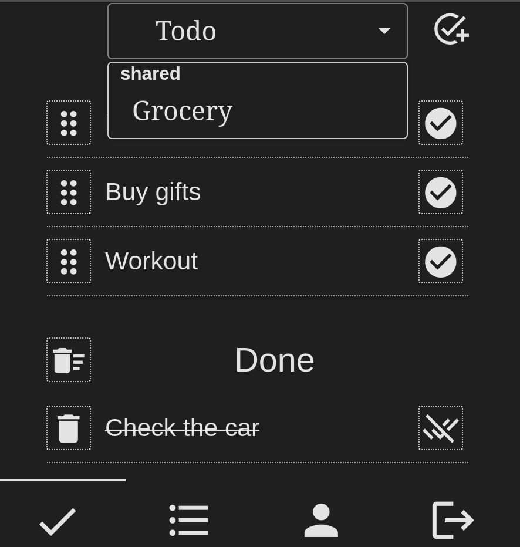
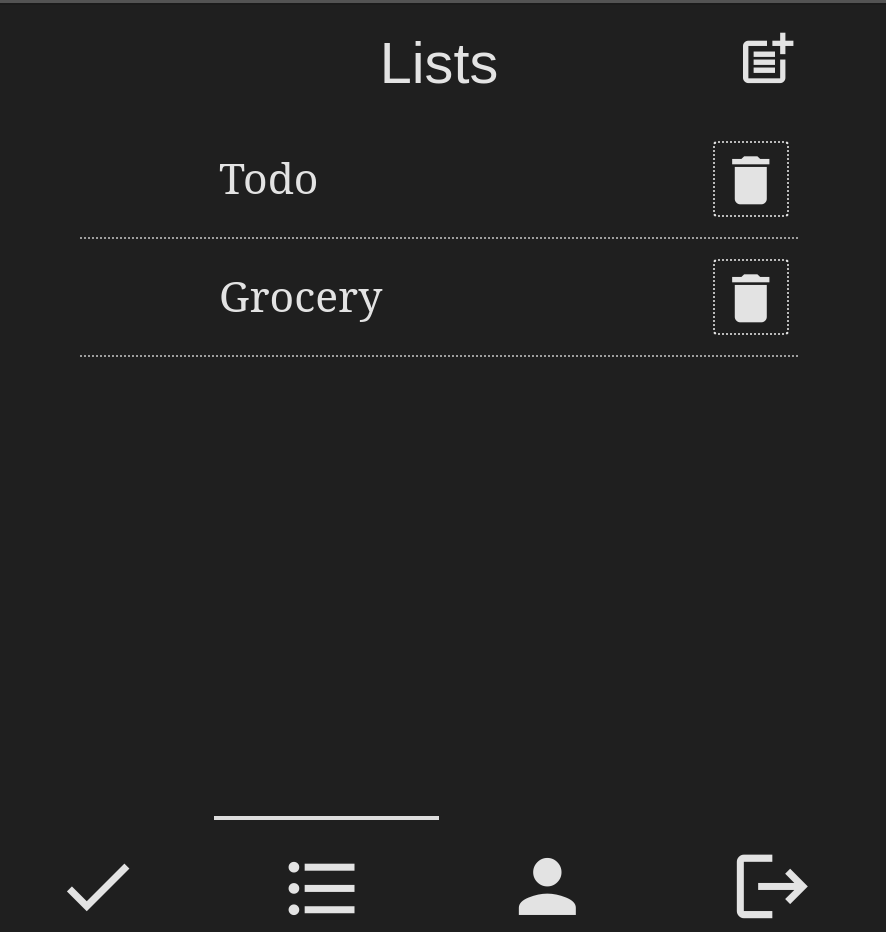
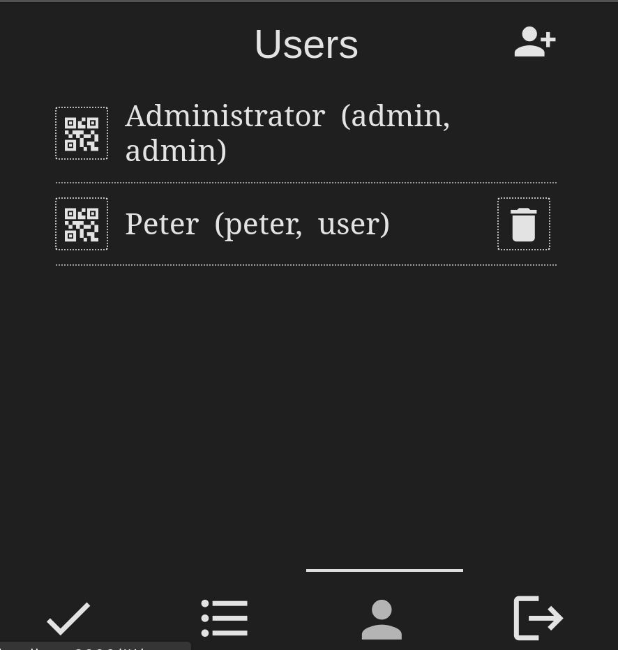
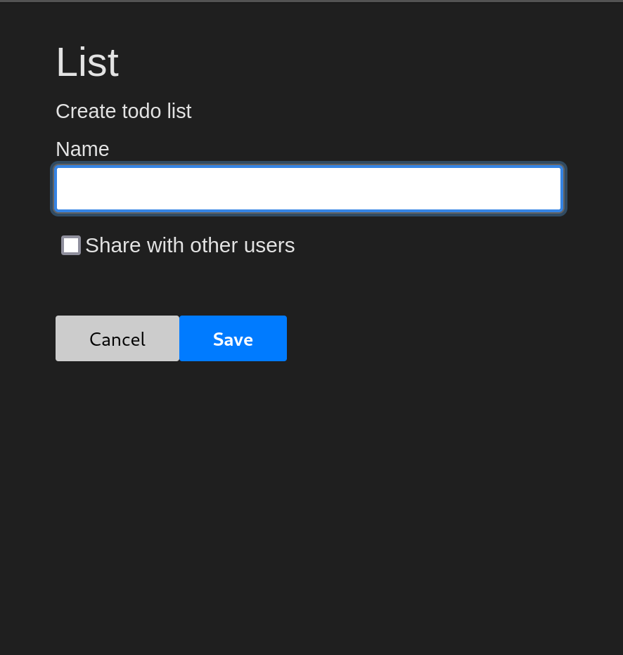
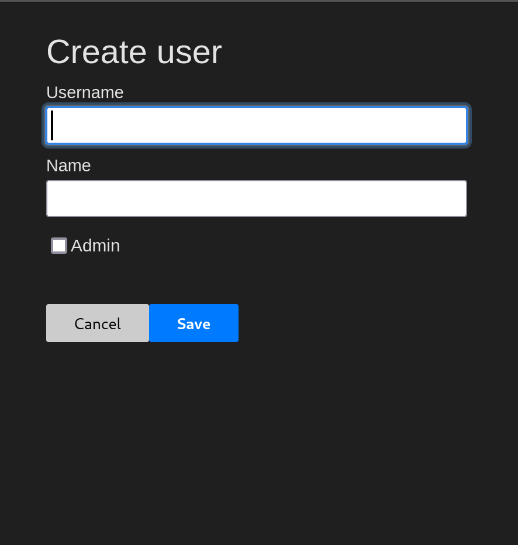
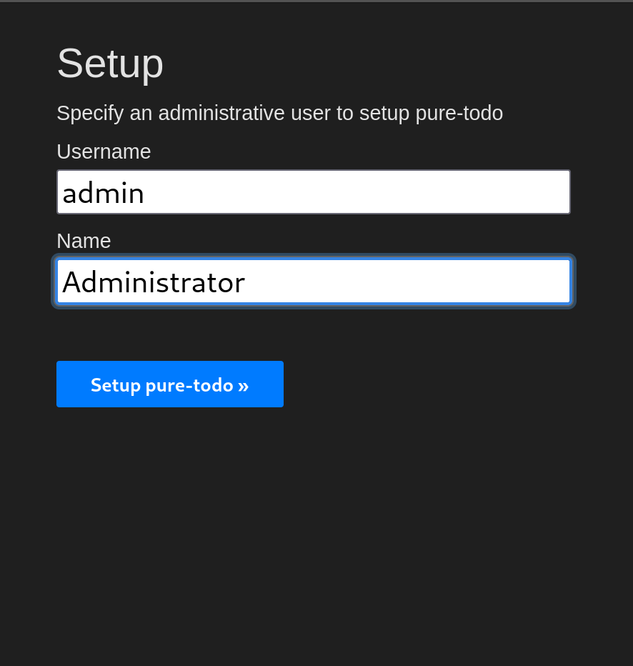
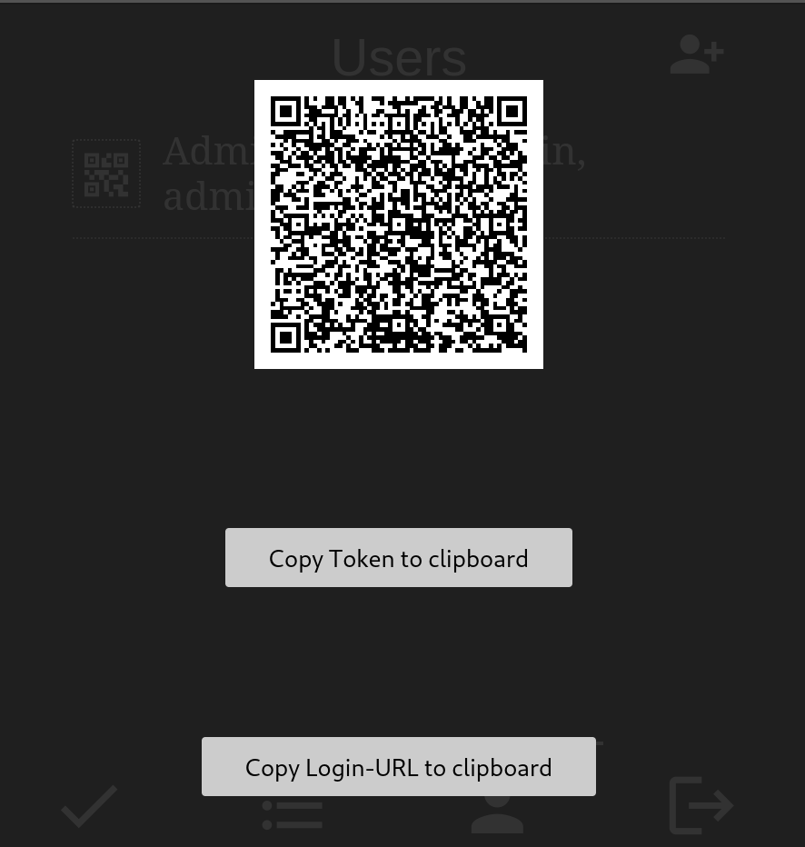

# pure-todo
pure-todo is a dead simple todo list application. Its pretty new and unpolished, but these basic features are working:

## Features
- Only one PHP file with some JavaScript and CSS
- REST API available (undocumented ATM)
- User Management with permissions
- Create private and shared lists
- Drag & Drop reordering
- Token-Based login with QR Code support
- Designed for mobile and desktop devices

## Screenshots

  
More screenshots

## Setup
The setup is pretty simple:

- Put the `public` and `data` on your PHP 8 capable webspace and ensure PHP has write permissions in `data`
- Change the token secret in `index.php` (`$_ENV["TOKEN_SECRET"] ??= "<use-a-strong-token-secret-here>";`)
- Create a (sub-) domain pointing to `public` as main directory
  - depending on your webserver, you need to add a rewrite rule to write every request to `index.php`

## todo

### Features
- Globally
  - Add filter / search option (button to blend in, input with no result may show button to create new?)
  - Export / Import data
- Items
  - Switch places for buttons in `Done` lists (Uncheck right, Delete and cleanup left)
- Lists
  - Edit option
  - show status (shared, private) in listing
  - Prioritize via drag indicator
- Users
  - Edit user
  - Disable user (possibly change `admin` field to `flags` and store all bits in one integer)
  
### Technical

- Enum for HttpMethods
- better Error handling

## Howto build custom icon font
Basic tutorial: https://sonneiltech.com/2021/02/how-to-create-your-own-custom-icon-fon

- open icomoon app (https://icomoon.io/app/#/select)
- select icons to use
- generate font (bottom right)
- download font (bottom right)
- copy css contents into php file
- remove all src() from @font-face
- generate base64 from ttf font (https://pilabor.com/dev)
- paste base64 `src: url(data:font/ttf;base64,AAEAAAALAI...AAAAAA) format('truetype');`
- use icon: `<i class="icon-drag_indicator"></i>`

## Icons / Behaviour
### Todo
- Header
  - filter / search: filter_list_alt, search
  - list dropdown: arrow_drop_down
  - add: add_task, add_circle_outline
- Content Todo
  - order via drag: drag_indicator
  - title: no icon, double tap to edit
  - finish: check_circle, check_circle_outline
  - caption bottom: done_all => mark all as done
- Content done (do I need the headline `Done` or is it enough to strike content and margin)
  - cleanup: delete_sweep
  - uncheck: remove_done

### Lists
- General
  - shared: connect_without_contact
  - private: lock_outline
- Header
  - `Lists` as headline
  - add: post_add
- Content
  - order via drag: drag_indicator
  - title: no icon, double tap to edit
  - edit: create (optional? maybe edit form has a delete button?)
  - delete: delete

### Users
- Header
    - `Users` as headline
    - add: person_add_alt_1
- Content
    - Name: no icon, double tap to edit
    - edit: create (optional? maybe edit form has a delete button?)
    - delete: delete

### Navigation
- todo: check
- list: format_list_bulleted
- user: person
- logout: logout
